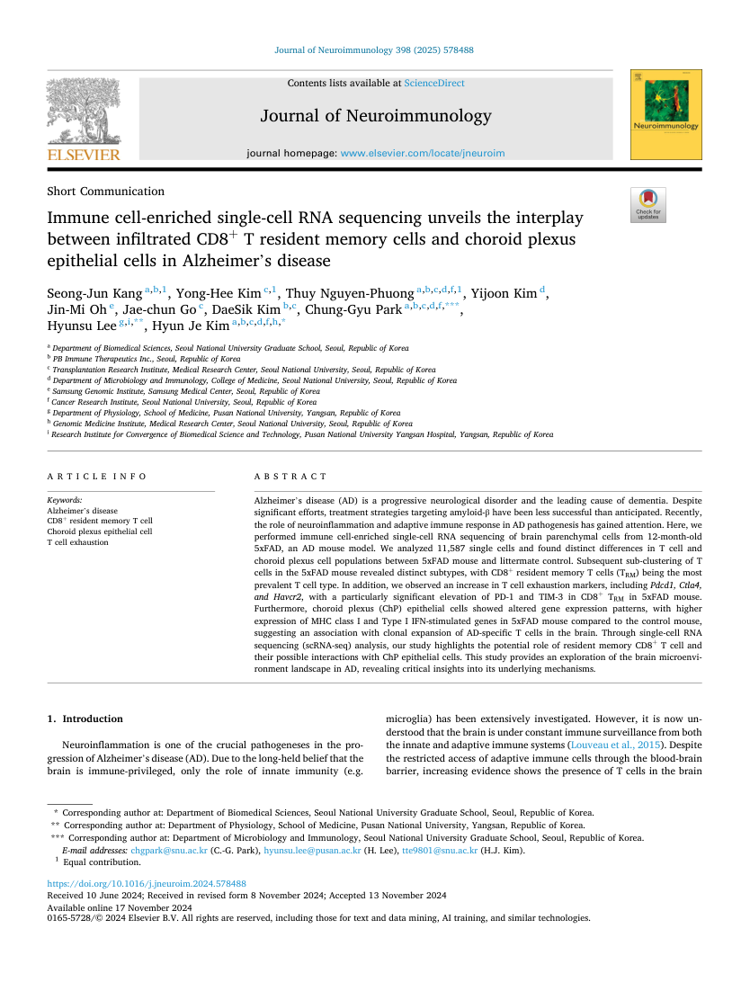
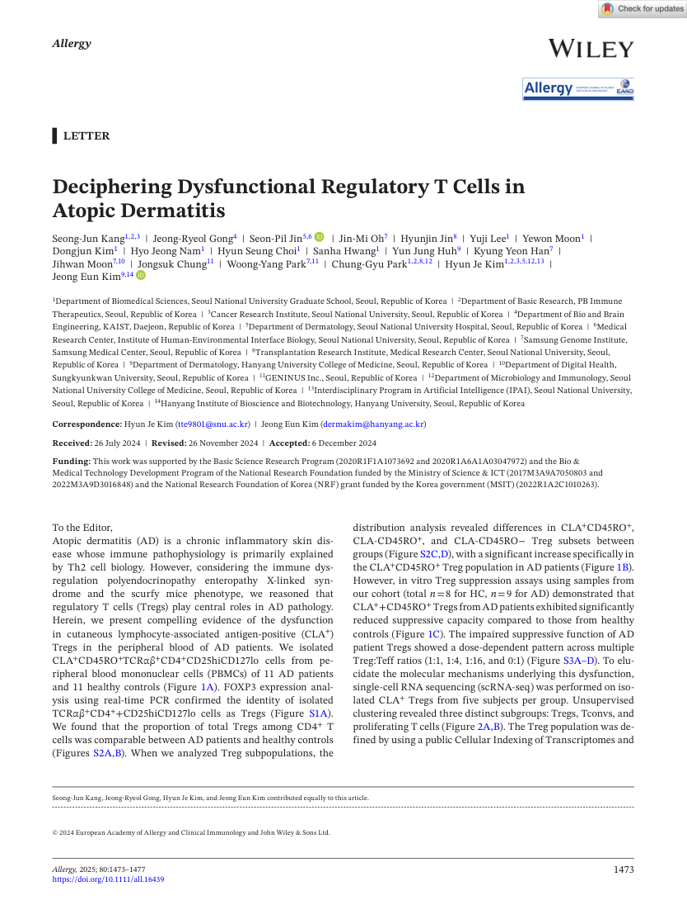
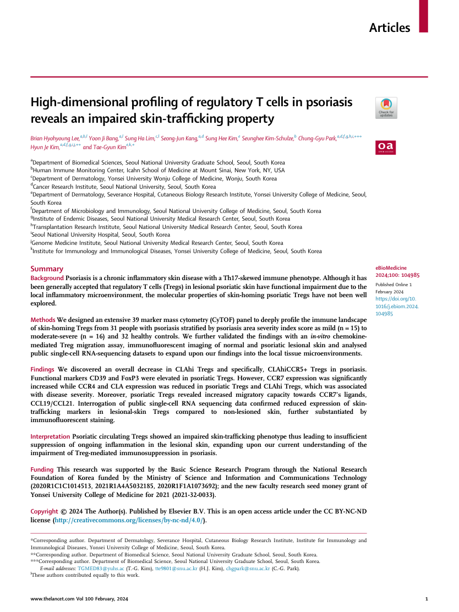
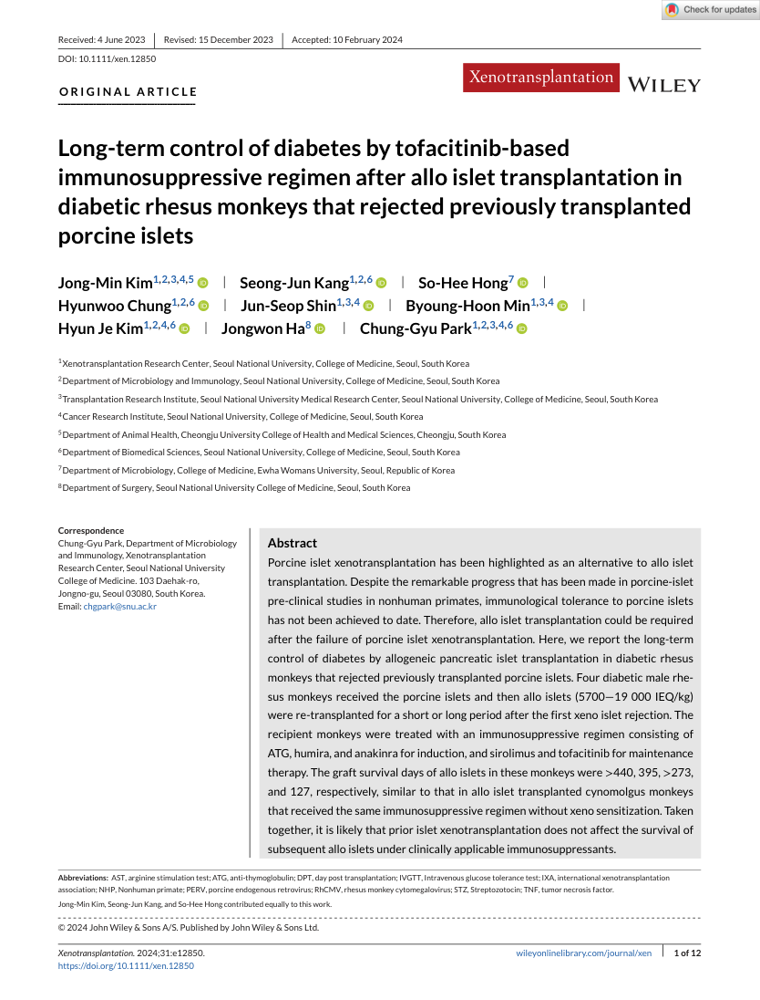
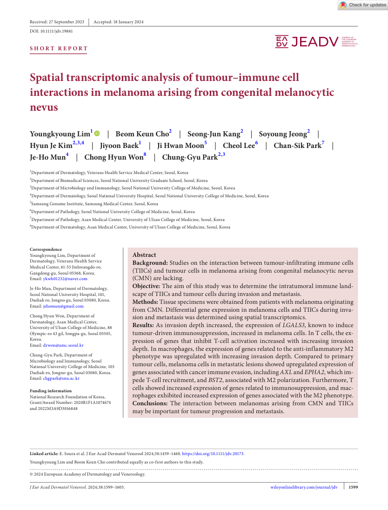
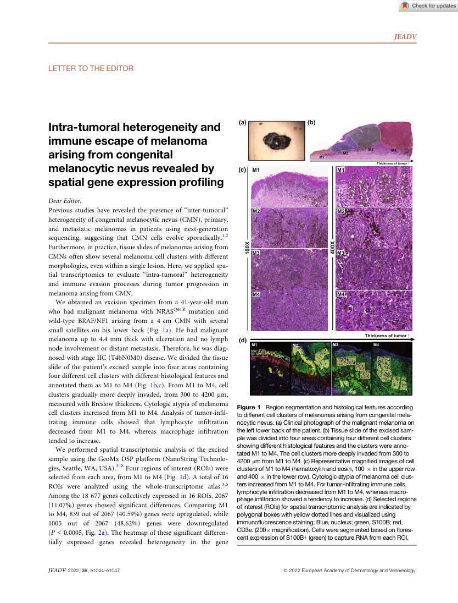
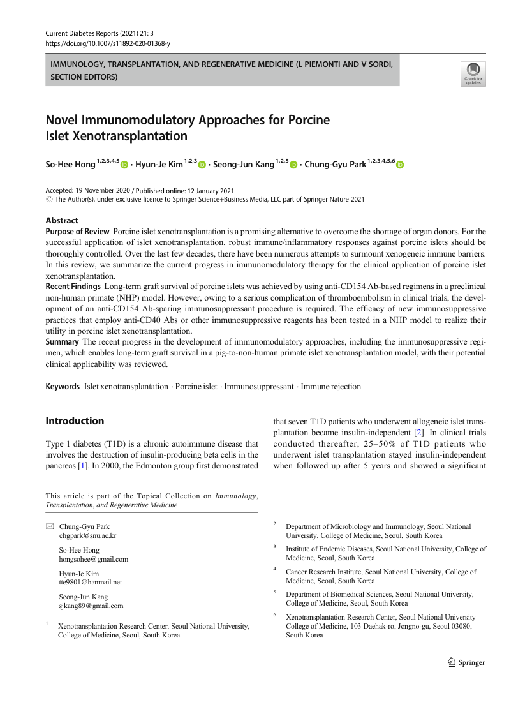
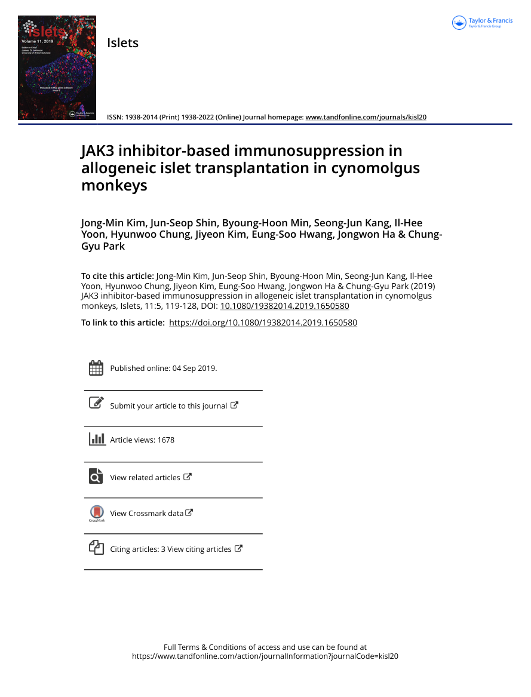

# Seong-Jun Kang, Ph.D.

Computational single-cell scientist — single-cell & spatial multi-omics, ML/DL analysis.
📍 Boston, MA  ·  ✉️ sjkang89@gmail.com

### 📄 [View CV (web)](https://awesomejun.github.io/Seong-Jun-CV/)

---

## Selected publications

First page of each paper is shown below. Click a thumbnail to open the full PDF, or **📖 [browse every page in the swipe viewer](https://awesomejun.github.io/Seong-Jun-CV/viewer.html)**.

<table>
<tr>
<td align="center" width="50%" valign="top">
 
<b><i>J. Neuroimmunology</i> (IF 2.9) · 2025</b> 
CD8⁺ T resident memory cells ↔ choroid plexus epithelium in Alzheimer's disease 
First (co-first) · <a href="papers/2025_JNI_Alzheimer_scRNAseq.pdf">⬇ PDF</a>
</td>
<td align="center" width="50%" valign="top">
 
<b><i>Allergy</i> (IF 12.6) · 2025</b> 
Deciphering dysfunctional regulatory T cells in atopic dermatitis 
First (co-first) · <a href="papers/2025_Allergy_AD_Treg.pdf">⬇ PDF</a>
</td>
</tr>
<tr>
<td align="center" valign="top">
 
<b><i>eBioMedicine</i> (IF 11.1) · 2024</b> 
High-dimensional profiling of regulatory T cells in psoriasis 
Co-author · <a href="papers/2024_eBioMedicine_psoriasis_Treg.pdf">⬇ PDF</a>
</td>
<td align="center" valign="top">
 
<b><i>Xenotransplantation</i> (IF 3.9) · 2024</b> 
Long-term diabetes control by a tofacitinib regimen after allo-islet transplantation 
First (co-first) · <a href="papers/2024_Xenotransplantation_tofacitinib.pdf">⬇ PDF</a>
</td>
</tr>
<tr>
<td align="center" valign="top">
 
<b><i>JEADV</i> (IF 9.2) · 2024</b> 
Spatial transcriptomics of tumour–immune interactions in nevus-arising melanoma 
Co-author · <a href="papers/2024_JEADV_melanoma_immune.pdf">⬇ PDF</a>
</td>
<td align="center" valign="top">
 
<b><i>JEADV</i> (IF 9.2) · 2022</b> 
Intra-tumoral heterogeneity and immune escape in nevus-arising melanoma 
First (co-first) · <a href="papers/2022_JEADV_melanoma_spatial.pdf">⬇ PDF</a>
</td>
</tr>
<tr>
<td align="center" valign="top">
 
<b><i>Current Diabetes Reports</i> (IF 4.2) · 2021</b> 
Novel immunomodulatory approaches for porcine islet xenotransplantation 
Co-author · <a href="papers/2021_CurrDiabRep_xeno_review.pdf">⬇ PDF</a>
</td>
<td align="center" valign="top">
 
<b><i>Islets</i> (IF 2.2) · 2019</b> 
JAK3 inhibitor-based immunosuppression in allogeneic islet transplantation 
First (co-first) · <a href="papers/2019_Islets_JAK3_isletTx.pdf">⬇ PDF</a>
</td>
</tr>
</table>

*First (co-first) = equal contribution (shared first authorship). The full publication list, including a co-first paper under review at* Nature Immunology, *is in the [CV](https://awesomejun.github.io/Seong-Jun-CV/).*

---

PDFs and first-page previews are shared by the author for academic review. Journal copyright applies to each published version of record.
